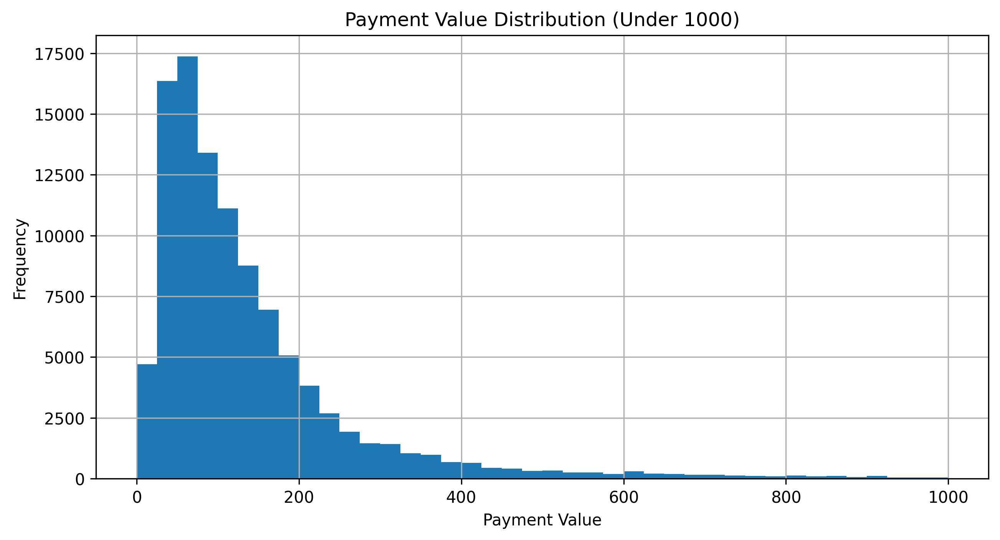
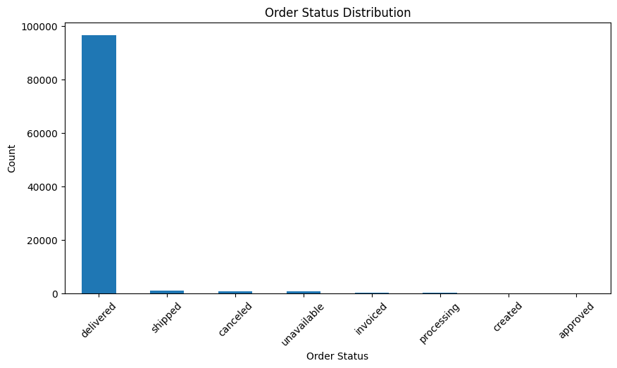
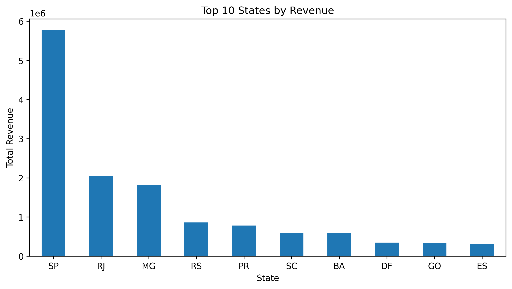
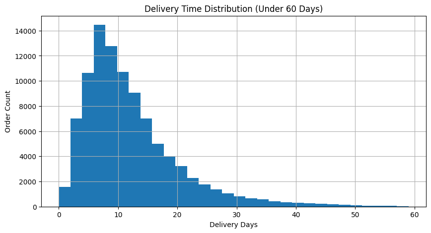
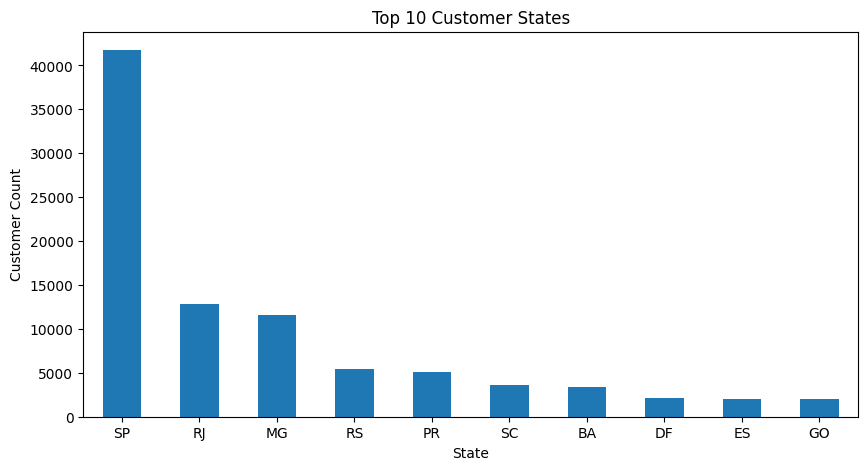
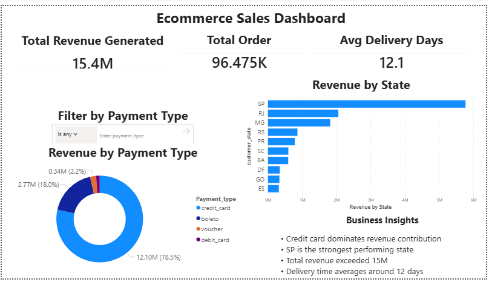
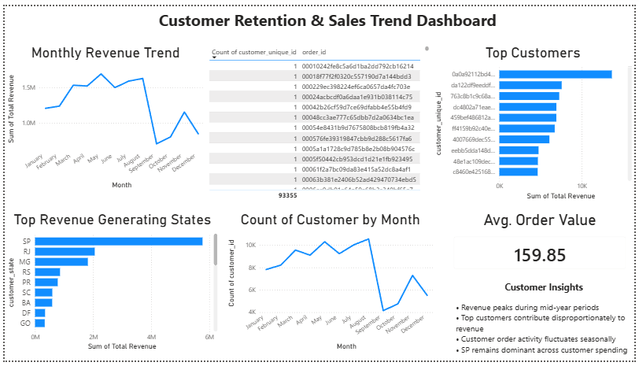

# Brazilian E-Commerce Analytics Project

## Project Overview

This project analyzes a Brazilian e-commerce dataset using Python, SQL, and Power BI to uncover customer behavior, revenue trends, payment patterns, delivery performance, and regional sales insights.

---

## Business Objectives

- Analyze customer purchasing behavior
- Identify top-performing states by revenue
- Understand delivery performance and logistics trends
- Explore payment preferences
- Detect outliers and data quality issues

---

## Technologies Used

- Python
- Pandas
- NumPy
- Matplotlib
- Seaborn
- SQL
- Power BI
- Git & GitHub

---

## Project Structure

```text
data/          -> Raw datasets
notebooks/     -> Python EDA notebooks
sql/           -> SQL business queries
dashboard/     -> Power BI dashboard files
screenshots/   -> Dashboard and notebook visuals
```
# Project Visuals

## Payment Value Distribution



---

## Top Customer States



---

## Revenue by State



---

## Delivery Time Distribution


---

## Top Value Customers



---

# Power BI Dashboard

This project also includes an interactive Power BI dashboard for ecommerce sales and customer analytics.

## Dashboard Features
- Revenue KPI tracking
- Monthly sales trend analysis
- Customer retention analysis
- Top customer identification
- Regional sales growth insights
- Payment method analysis
- Average order value tracking

## Tools Used
- Power BI
- DAX
- Power Query
- Data Modeling

---

## Dashboard Preview

### Ecommerce Sales Dashboard


### Customer Retention Dashboard



